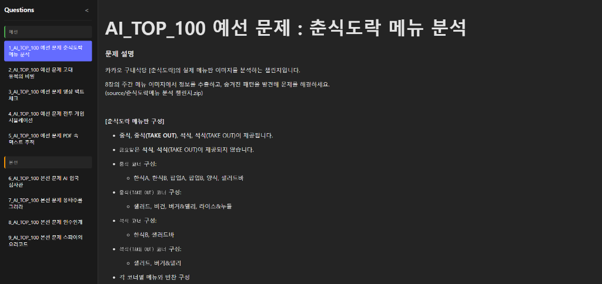

# AI_TOP_100 문제 풀이 플랫폼

이 프로젝트는 카카오임팩트와 브라이언임팩트가 주최한 'AI_TOP_100' 대회의 예선 및 본선 문제들을 수집하고, 이를 로컬 환경에서 직접 풀어볼 수 있도록 돕는 학습용 플랫폼입니다.

> **문제 출처**: [카카오 브런치 - AI TOP 100](https://brunch.co.kr/@andkakao/)

<p align="center">
  
</p>

## 프로젝트 취지

이 프로젝트는 다음과 같은 목적을 가지고 만들어졌습니다.

1.  **쉬운 문제 풀이를 위한 웹 제공**: 복잡한 설정 없이 웹 브라우저에서 바로 문제를 확인하고 풀 수 있는 환경을 제공합니다.
2.  **개인 SOLVE 아카이빙 및 공유**: 사용자가 작성한 답안을 체계적으로 저장하고 관리할 수 있도록 지원합니다.

## 프로젝트 구성

이 프로젝트는 크게 두 가지 부분으로 나뉩니다.

1.  **문제 수집 (Crawling)**: 브런치(brunch.co.kr)에 공개된 문제들을 자동으로 수집하여 Markdown 형식으로 저장합니다.
2.  **문제 풀이 플랫폼 (Platform)**: 수집된 문제들을 조회하고, 코드를 작성하여 솔루션을 저장할 수 있는 웹 애플리케이션입니다.

## 시작하기

### 필수 요건

-   Python 3.8 이상
-   Node.js 18 이상
-   `uv` (Python 패키지 매니저)

### 설치 및 실행

1.  **저장소 클론 및 이동**
    ```bash
    git clone <repository-url>
    cd AI_TOP_100
    ```

2.  **문제 수집 (선택 사항)**
    이미 `question` 폴더에 문제가 수집되어 있지만, 다시 수집하려면 다음 명령어를 실행하세요.
    ```bash
    uv run crawl_questions.py
    python3 clean_questions.py
    ```

3.  **백엔드 서버 실행**
    ```bash
    uv run platform/backend/main.py
    ```
    서버는 `http://localhost:8000`에서 실행됩니다.

4.  **프론트엔드 서버 실행**
    새로운 터미널을 열고 다음을 실행하세요.
    ```bash
    cd platform/frontend
    npm install
    npm run dev
    ```
    브라우저에서 `http://localhost:5173`으로 접속하세요.

## 기능

-   **문제 목록 조회**: 수집된 모든 예선 및 본선 문제들을 확인할 수 있습니다.
-   **문제 풀이**: 각 문제(Q1, Q2 등)별로 나누어 코드를 작성할 수 있습니다.
-   **다국어 지원**: Python, JavaScript, C, C++, Markdown 등 다양한 언어로 답변을 작성할 수 있습니다.
-   **솔루션 저장**: 작성한 코드는 로컬의 `solve` 디렉토리에 자동으로 저장됩니다.
