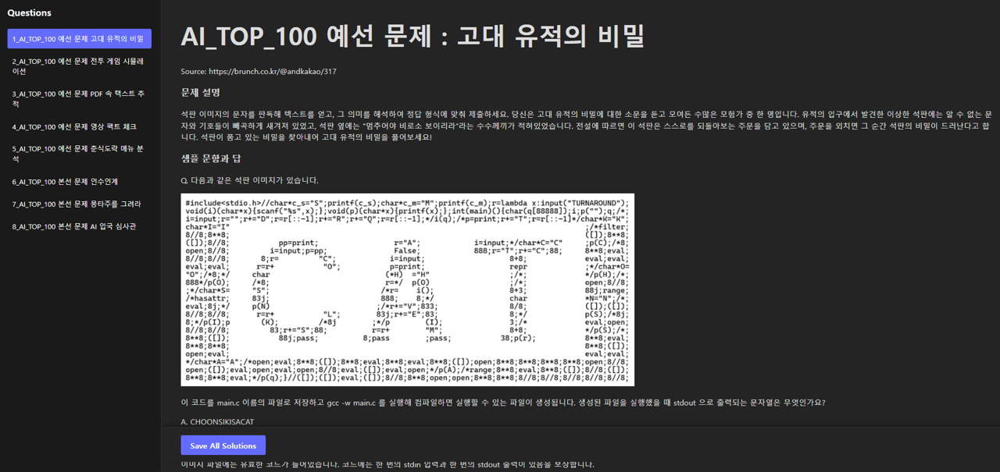

# AI_TOP_100 Problem Solving Platform

This project is a study platform designed to collect and solve questions from the 'AI_TOP_100' competition hosted by Kakao Impact and Bryan Impact. It allows you to crawl the problems and solve them in a local environment.



## Project Structure

The project consists of two main parts:

1.  **Crawling**: Automatically collects problems published on Brunch (brunch.co.kr) and saves them in Markdown format.
2.  **Platform**: A web application where you can view the collected problems, write code, and save your solutions.

## Getting Started

### Prerequisites

-   Python 3.8 or higher
-   Node.js 18 or higher
-   `uv` (Python package manager)

### Installation and Run

1.  **Clone and Enter Repository**
    ```bash
    git clone <repository-url>
    cd AI_TOP_100
    ```

2.  **Crawl Questions (Optional)**
    Questions are already collected in the `question` folder. To re-crawl, run:
    ```bash
    uv run crawl_questions.py
    python3 clean_questions.py
    ```

3.  **Run Backend Server**
    ```bash
    uv run platform/backend/main.py
    ```
    The server runs at `http://localhost:8000`.

4.  **Run Frontend Server**
    Open a new terminal and run:
    ```bash
    cd platform/frontend
    npm install
    npm run dev
    ```
    Access `http://localhost:5173` in your browser.

## Features

-   **Browse Questions**: View all collected preliminary and final round questions.
-   **Solve Problems**: Write code for each sub-question (Q1, Q2, etc.) separately.
-   **Multi-language Support**: Write answers in Python, JavaScript, C, C++, Markdown, etc.
-   **Save Solutions**: Your code is automatically saved in the local `solve` directory.

## Language

-   [한국어 (Korean)](README.md)
-   [English](README_EN.md)
