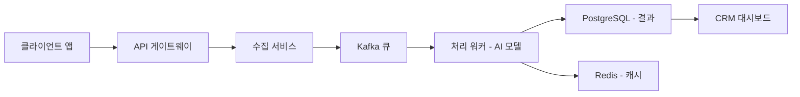

# 모범 답안: Q8. 인수인계 자료 작성

## 출제 의도

### 문제 패턴

**P3. 소통 및 설득 (Persuasion)** - 협업, 리더십, 프레젠테이션 등 목표가 있는 커뮤니케이션 및 문서 작성

### 핵심 측정 역량

1. **기술 문서 작성 능력**: 복잡한 시스템을 명확하게 설명하는 문서 작성
2. **구조화 능력**: 프로젝트 개요, 아키텍처, API, 트러블슈팅을 체계적으로 정리
3. **독자 고려**: 인수인계 받는 사람의 관점에서 필요한 정보 우선순위 결정
4. **체계적 검증 유도**: 문서의 완성도와 실용성 평가

### 왜 '딸깍'으로 풀리지 않는가?

- "인수인계 문서 써줘"라고 하면 **일반적인 템플릿**만 제공됨
- 실제 프로젝트의 **구체적인 맥락과 히스토리**를 AI가 모름
- 트러블슈팅 가이드는 **실제 경험에서 나온 노하우**가 필요
- 팀 내 **암묵지(tacit knowledge)**를 명시화하는 것은 사람만 가능

### 난이도 구조

- **Q1 (Easy)**: 프로젝트 개요 - 기본적인 설명
- **Q2 (Medium)**: 시스템 아키텍처 - 구조적 사고 필요
- **Q3 (Medium)**: API 문서 - 표준 형식 따르기
- **Q4 (Hard)**: 트러블슈팅 - 실무 경험 기반 (킬러 문항)

---

## 권장 접근법

### 1단계: 사람의 분석

- 프로젝트의 핵심 기능과 비즈니스 목표 정리
- 아키텍처의 주요 컴포넌트와 데이터 흐름 파악
- 자주 발생하는 문제와 해결 방법 정리
- 인수인계 받는 사람이 가장 먼저 알아야 할 것 우선순위 결정

### 2단계: AI와의 협업

```text
프롬프트 예시:
"다음 정보를 바탕으로 인수인계 문서를 작성해줘:

프로젝트: AI 기반 고객 분석 모듈
주요 기능: 고객 상호작용 데이터 수집, NLP 감정 분석, CRM 연동
기술 스택: Python, Kafka, PostgreSQL, Redis, Kubernetes
팀 구성: 백엔드 3명, ML 2명, 인프라 1명

다음 섹션별로 작성해줘:
1. 프로젝트 개요 (목적, 범위, 이해관계자)
2. 시스템 아키텍처 (컴포넌트 다이어그램 포함)
3. API 문서 (주요 엔드포인트)
4. 트러블슈팅 가이드 (자주 발생하는 문제와 해결법)"
```

### 3단계: 사람의 검증

1. 생성된 문서를 **실제 시스템과 대조**하여 정확성 확인
2. **새로운 팀원 관점**에서 이해하기 어려운 부분 보완
3. **빠진 중요 정보**(환경 변수, 배포 절차 등) 추가
4. **실제 트러블슈팅 경험**으로 가이드 보강

---

## 샘플 답변

### Q1. 프로젝트 개요

**프로젝트명**: AI 기반 고객 분석 모듈

**설명**:
이 모듈은 여러 채널(웹, 모바일, 고객지원)에서 고객 상호작용 데이터를 수집하고 NLP 모델을 적용하여 감정과 의도를 추출합니다. 처리된 데이터는 CRM 시스템에 공급되어 실시간 개인화 마케팅과 지원을 가능하게 합니다.

**목표**: 선제적 참여를 통해 고객 유지율을 15% 향상

**이해관계자**:
- 마케팅팀: 개인화 캠페인 활용
- 고객지원팀: 실시간 감정 분석 활용
- 데이터팀: 분석 리포트 생성

### Q2. 시스템 아키텍처



**컴포넌트 설명**:
- **API 게이트웨이**: 인증, 레이트 리미팅, 라우팅
- **수집 서비스**: 다중 채널 데이터 정규화
- **Kafka 큐**: 비동기 메시지 처리로 부하 분산
- **처리 워커**: GPU 기반 NLP 모델 추론
- **PostgreSQL**: 분석 결과 영구 저장
- **Redis**: 실시간 대시보드용 캐시

### Q3. API 문서 (로그인)

**엔드포인트**: `POST /api/v1/auth/login`

**설명**: 사용자를 인증하고 JWT 토큰을 반환합니다.

**요청 본문**:
```json
{
  "email": "user@example.com",
  "password": "secure_password_123"
}
```

**응답 (200 OK)**:
```json
{
  "token": "eyJhbGciOiJIUzI1NiIsIn...",
  "expires_in": 3600,
  "user": {
    "id": "user_123",
    "role": "admin"
  }
}
```

**에러 응답**:
- `401 Unauthorized`: 잘못된 자격 증명
- `429 Too Many Requests`: 로그인 시도 제한 초과

### Q4. 트러블슈팅

**문제**: `처리 워커` 높은 지연시간 / 타임아웃

**증상**:
- 대시보드에서 "분석 중..." 상태 지속
- Grafana 알림: "Processing latency > 30s"

**원인 및 해결**:

| 원인 | 진단 방법 | 해결책 |
|------|----------|--------|
| Kafka 컨슈머 지연 | Grafana에서 consumer lag 확인 | 처리 워커 레플리카 스케일 업 (HPA) |
| GPU 메모리 고갈 | `nvidia-smi` 로그 확인 | `config.yaml`에서 배치 크기 32 → 16 |
| 모델 로딩 실패 | 워커 로그에서 OOM 확인 | 모델 캐시 재시작, 메모리 증설 |

**긴급 연락처**:
- 인프라 이슈: @infra-team (Slack)
- 모델 이슈: ml-support@company.com

---

## 핵심 교훈

> "인수인계 문서는 **AI가 틀을 잡아주고**, **사람이 실제 경험으로 채워야** 한다. 특히 트러블슈팅 가이드는 **직접 겪어본 문제**와 **해결 노하우**가 담겨야 가치가 있다."

이 문제는 기술 문서 작성에서 AI의 구조화 능력과 사람의 도메인 지식이 어떻게 협업해야 하는지를 보여줍니다. **좋은 문서는 읽는 사람의 관점**에서 작성되어야 합니다.
